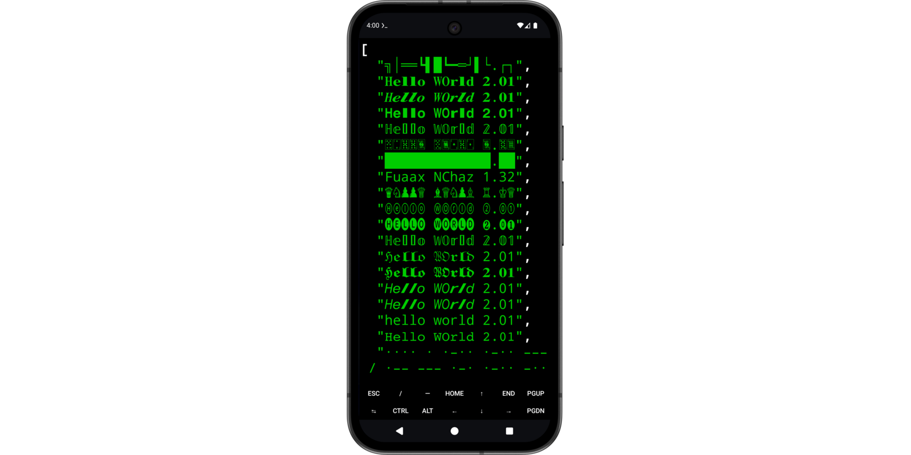
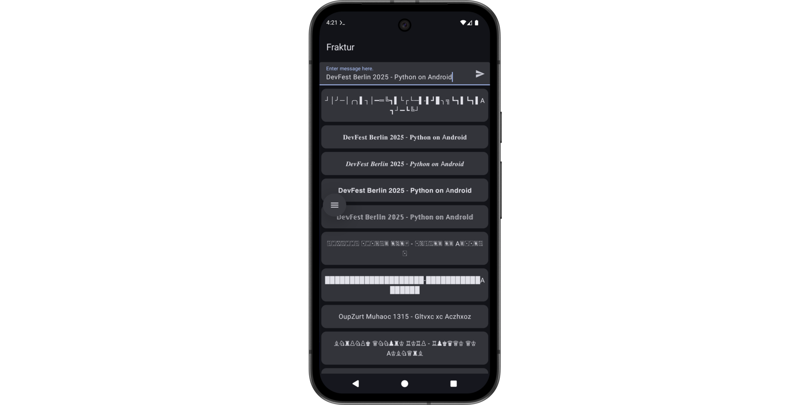
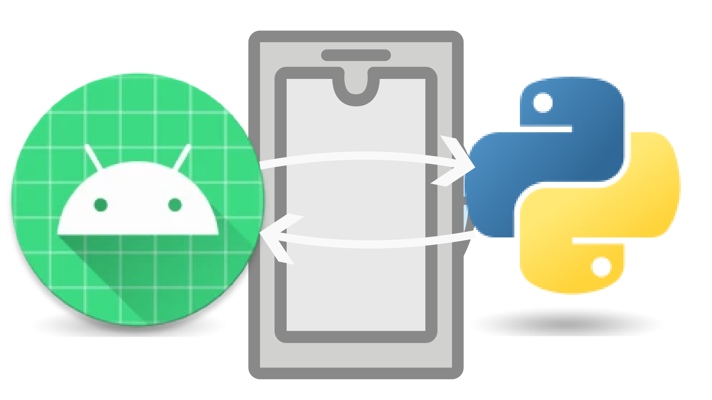
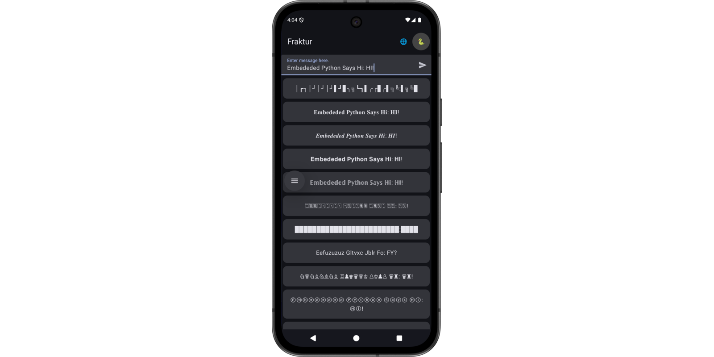

# Python on Android

## How to Integrate Python in Your Android Apps

### by Mario Bodemann

----------

# (Disclaimer: _Mario Bodemann_)

* Android Developer Advocate @ Yubico
  * We do YubiKeys
  * Come talk to me afterwards for a chance to get one
* Ask me about 
  * FIDO 2 / WebAuthn 
  * Android Development
  * Building and sewing things
* I use Python alongside Kotlin (#noHate)

----------

{: width="1920" }

---------

# Python: Hello World

* Low WTFs per minute
* Runs everywhere (Linux, Mac, Windows, Android)
  * We ignore iOS 🫢
* Compilation at runtime

~~~ python
def hello(name):
  print(f"Hello World, {name}!")

hello(input('What is your name? '))
~~~

-------------

# Python: Hello scipy

~~~ python
from scipy.signal import wiener
import matplotlib.pyplot as plt
import numpy as np

rng = np.random.default_rng()
img = rng.random((40, 40))

filtered_img = wiener(img, (5, 5))
f, (plot1, plot2) = plt.subplots(1, 2, label="🌭")
plot1.imshow(img)
plot2.imshow(filtered_img)
plt.show()
~~~

----------

# Python: How I Use It

~~~ bash
fraktur -m rainbow -b round -f caps -- Welcome!
~~~

~~~ bash
fraktur -f chess -- Welcome!
~~~

~~~ bash
fraktur -f slack -- Welcome!
~~~

--------

# Python on Android

--------

# Python on Android: Termux

* Termux is an Android app
  * https://termux.org
* Install through 'F-Droid'
* Runs a terminal
* Can install open source tools
* Python is OSS 🤯

--------

# termux-gui & termux-api

* Plugin for Termux
* Gives access to Android UI
  * clipboard, camera,
  * SMS, calls, contacts
  * …

------

# DEMO: Termux in Android

~~~ termux
adb install f-droid.apk
~~~

~~~ termux
install termux
~~~

~~~ termux
termux-dialog -t hello
~~~

~~~ { .termux-python .hidden }
/Users/Mario.Bodemann/Library/Android/sdk/emulator/emulator -no-snapshot @Pixel_9a
~~~

-------

# termux-gui in python

* using _subprocess_ library
* calling termux-gui binaries

~~~ pbcopy
import subprocess

r = subprocess.run(
    ["termux-dialog", "-t", "hello"],
    capture_output=True
)

print(r.stdout.decode())
~~~

--------

# Termux: Fraktur

~~~ pbcopy
import sys
sys.path += ['/data/data/com.termux/files/home/s9s']

import fraktur
options = fraktur.generate(
    'Hello DevFest World',
    font='all'
).splitlines()

print(options)
~~~

------

# Fraktur: Show Options to User

~~~ pbcopy
import subprocess
proc = subprocess.run(
    [
        "termux-dialog", 
        "sheet", 
        "-t", "Frakturize?", 
        "-v", f"{options}"
    ],
    capture_output=True
)

print(proc.stdout.decode())
~~~

---------

# Fraktur: Copy Answer to Clipboard

~~~ pbcopy
import json
response = json.loads(
    proc.stdout
)

subprocess.run([
    "termux-clipboard-set", 
    response["text"]
])
~~~

---------

# 🎉

-------

# Sub Summary

* Termux with Python
  * Python can call Fraktur
  * Python can call Termux
  * Termux can do Android
* Ergo
  * **Python Fraktur can interact with Android**

--------

# Termux 2.0

 

-------

# Current approach

* Bridging from Python to Termux to Android
* Limited UI flexibility
* brittle 
  * Android says no?
  * Termux says no?

-------

# Termux Python Web Android App

* Python Web
  * Flask
  * Fraktur
* Android UI
  * Jetpack Compose
  * Retrofit

-------

# Termux Web: Flask 🧪

* lightweight
* easy-to-use 
* web microframework

~~~ pbcopy
pip install flask
~~~

-----

# Import Flask and create Server

~~~ termux-python
from flask import Flask
app = Flask('Fraktur.Server')

@app.post('/')
def hello():
  # see next slide

app.run()
~~~

----------

# Call *fraktur* for Server POST

~~~ termux-python
message = request.get_data().decode()

return fraktur.generate(
    message, 
    font='all'
).splitlines()
~~~

-----

# DEMO: *Flask Server on Android*

* test webserver
* should return list of messages
* but formated through _fraktur_

~~~ { .termux-python .hidden }
import sys
sys.path += ['/data/data/com.termux/files/home/s9s']

from flask import Flask
app = Flask('Fraktur.Server')

@app.post('/')
def hello():
    import fraktur
    from flask import request

    message = request.get_data().decode()

    return fraktur.generate(
        message, 
        font='all'
    ).splitlines()
    
app.run()
~~~

~~~ termux-python 
curl 127.0.0.1:5000 -d 'Hello WOrld 2.01' | jq
~~~

-------

------------

# The other 50%: Android HTTP Client

* "default" Android App
* MVVM
* Retrofit
* Kotlinx Serialization
* Coroutines

* No tests, because YOiLO
{: .hidden }

-------

# Retrofit Service

~~~ kotlin
interface PythonService {
    @POST("/")
    suspend fun getFraktures(
        @Body body: String
    ): List<String>
}
~~~

---------------

# Backend

~~~ kotlin
class PythonBackend {
  private val service = Retrofit
    // add converters etc.
    .create(PythonService::class.java)

  suspend fun requestFraktures(message: String) =
    service
      .getFraktures(message).map { 
        it.removeSurrounding("\"") 
      }
}
~~~

------------

# User Interface: View Model

~~~ kotlin
fun loadNewFraktures(message: String) {
  viewModelScope.launch {
    fraktures = backend
      .requestFraktures(
        message
      )
  }
}
~~~

----------

# Jetpack Compose

~~~ kotlin
LazyColumn {
  items(fraktures) { fraktur ->
    Card (
      Modifier.clickable {
        copyToClipboard(fraktur)
      }) {
      Box {
        Text(
          text = fraktur
        )
      }
    }
  }
}
~~~

---

# Android Interop: Clipboard Manager

~~~ kotlin
val manager = getApplication()
  .getSystemService<ClipboardManager>()

val clip = ClipData
  .newPlainText(
    "Fraktur", 
    fraktur
  )
  
manager?.setPrimaryClip(clip)
~~~

----------

# DEMO: Android calling Python Web

-------

# Sub Summary

good                        | improvements
----------------------------|---------
clean separation (work/ui)  | android:usesCleartextTraffic="true" 👀
flexible                    | manual python dependencies
native                      | 
fast                        | developer and user experience 🧐  

--------

# Chaquopy

## Python Runtime Embedded in Android App

 

-----

# Chaquopy

> https://chaquo.com/
{ style='font-size:98px' }

* embedding Python runtime in Android App 🤯
* Android -> Python **&&** Python -> Android 🤯
* *Wonderous 🤯*

--------

# Chakotay Dependencies

~~~ toml
// libs.versions.toml
[versions]
python = "16.1.0"

[plugins]
python = { id = "com.chaquo.python", version.ref = "python" }
~~~

~~~ gradle
// /build.gradle.kts
alias(libs.plugins.python) apply false

// /app/build.gradle.kts
alias(libs.plugins.python)
~~~

---------

# Configuration

~~~ gradle
// /app/build.gradle.kts
chaquopy {
    defaultConfig {
        pip {
            install("pystitch==1.0.0")
        }

        version = "3.13"
    }
}
~~~

-----------

# Back To Kotlin: Setup in Service

~~~ kotlin
val python: Python by lazy {
  if (!Python.isStarted()) {
    Python.start(
      AndroidPlatform(context)
    )
  }

  Python.getInstance()
}
~~~

----------

# 'Bind' Python in Kotlin

~~~ kotlin
suspend fun requestFraktures(
  message: String
): List<String> {
  val fraktur = python.getModule("fraktur")
  
  val result = fraktur.callAttr(
    "generate", 
    message, 
    "all"
  )

  val stringResult = result.toString()
  return stringResult.split("\n")
}
~~~

--------

# DEMO of embeded Python

// THINK ABOUT WIENERS
{: .hidden}

-------

# UseCase

## 🪡🧵 @ 🤖🐻

--------

# GDG Berlin Android Booth @ Droidcon Berlin

* Take your Composeables, turn it into an embroidered patch
* Embroidery file creation lib *pystitch*
  * Translation from Python to Java not functional
  * Python in Android needee
  * 'chaquopy'

-------

# Summary

* [Termux](https://termux.org)
  * unix like Terminal on the go
  * experiment with OSS software
* [WebServer](https://flask.palletsprojects.com/)
  * make your phone into a server
  * serving versus surfing 🏄
* [Embedding](https://chaquo.com/)
  * make your app speak Python
  * use all^1 of your Python libraries
  * nice separation of work and design

-----------

# Thanks {: style="flex:1" } 

## Questions {: style="flex:1" }  

### Answers {: style="flex:1" }  

github.com/mariobodemann/talk-devfest-berlin-2025-python-on-android
 

